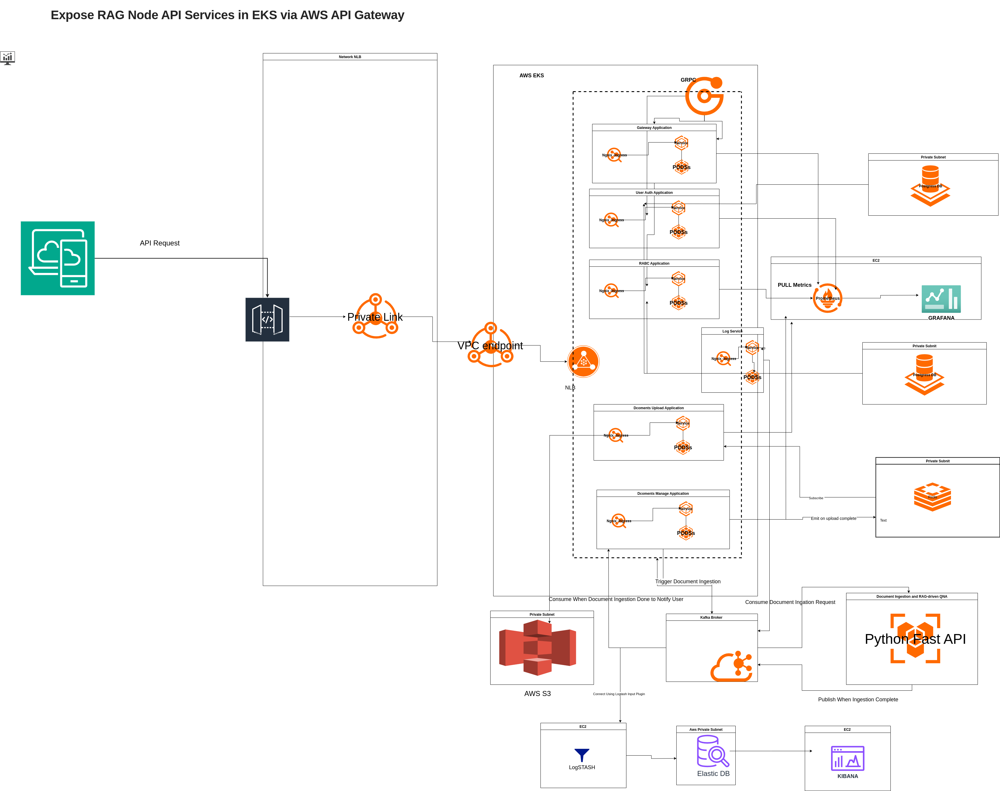

# nestjs-rag-microservice

## NestJS Monorepo Microservices architecture featuring:

 - User Management with role-based access control (RBAC)
 - Gateway service acting as the API gateway and routing requests
 - User Authentication service with secure JWT-based login
 - Document Management system supporting document upload, storage
 - Designed for modularity, scalability

## Prerequisites for - Nest Js  Micro Service

  - Node - Node.js 20+
  - Docker
  - Radis DB
  - Postgres DB
  - Prometheus
  - Grafana
  - Helm
  - Minikube - Local Testing
  - kubectl

  

 

## Compile and run the project

```bash
$ nvm use 20
$ npm install
$ npm build
```

```bash
# development
$ npm run start:all
```

## Create Admin
```bash
curl -X POST http://localhost:4000/register \
  -H "Content-Type: application/json" \
  -d '{
    "name": "admin",
    "email": "admin@ymail.com",
    "password": "123456"
  }'
```

## Run tests

```bash
# unit tests
$ npm run test

# test coverage
$ npm run test:cov
```


# Deployment

## Docker

```bash
#check the images
chmod +x deploy/scripts/build-all.sh
./deploy/scripts/build-all.sh

#check the gateway images , apply for other service same
docker images | grep gateway

#debug the image proto is in lib folder
docker run --rm -it gateway:local sh
ls dist/apps/gateway

```

## Generate Helm Chart

```bash
chmod +x deploy/scripts/generate-helm.sh
./deploy/scripts/generate-helm.sh

#output 
🚀 Generating Helm chart for gateway...
Creating ./deploy/helm/gateway
✅ Helm chart for gateway ready at ./deploy/helm/gateway
🚀 Generating Helm chart for user-auth...
Creating ./deploy/helm/user-auth
✅ Helm chart for user-auth ready at ./deploy/helm/user-auth
🚀 Generating Helm chart for upload...
Creating ./deploy/helm/upload
✅ Helm chart for upload ready at ./deploy/helm/upload
🚀 Generating Helm chart for rbac...
Creating ./deploy/helm/rbac
✅ Helm chart for rbac ready at ./deploy/helm/rbac

```


## Use MiniKube to test in local - Ex gateway service , do the same steps for rest of the Micro services


```bash

minikube start --driver=docker
minikube status

helm install gateway ./deploy/helm/gateway


kubectl get pods
kubectl describe node

#check pods status
kubectl get pods -l app.kubernetes.io/name=gateway

#restart the deployment if required
kubectl rollout restart deployment gateway

```

## Prometheus & Grafana

```bash
# Apply namespace for monitoring
kubectl create namespace monitoring

# Deploy Prometheus configmap, deployment & service
kubectl apply -f prometheus-configmap.yaml
kubectl apply -f prometheus-deployment.yaml
kubectl apply -f prometheus-service.yaml

# Deploy Grafana deployment & service
kubectl apply -f grafana-deployment.yaml
kubectl apply -f grafana-service.yaml

# Verify pods & services
kubectl get pods -n monitoring
kubectl get svc -n monitoring


```
